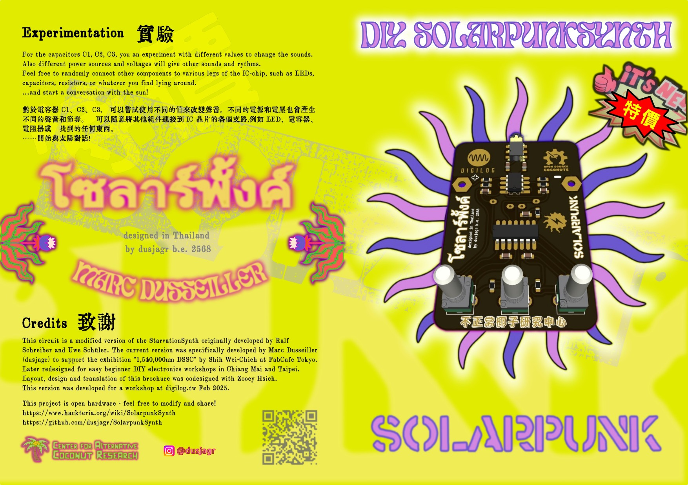
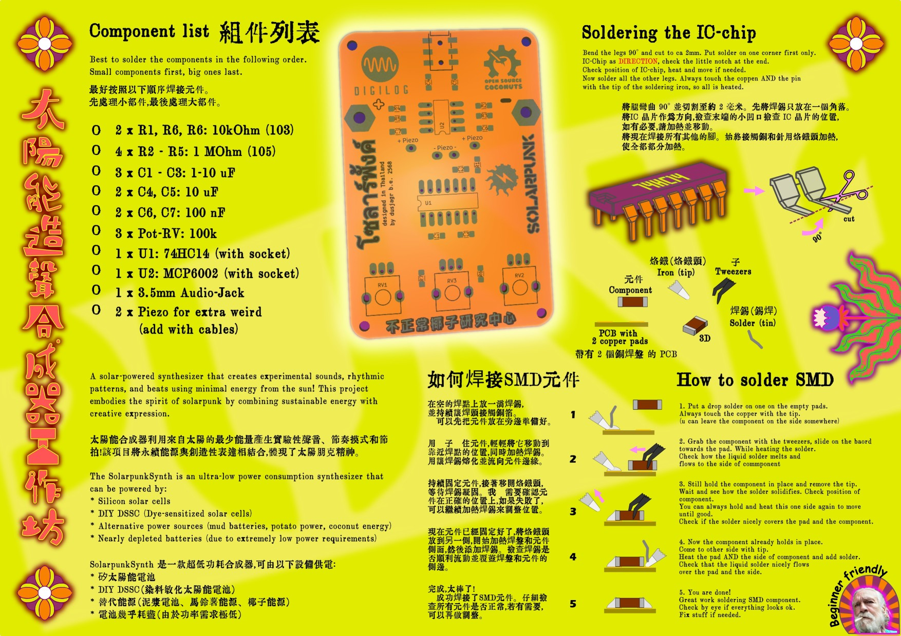
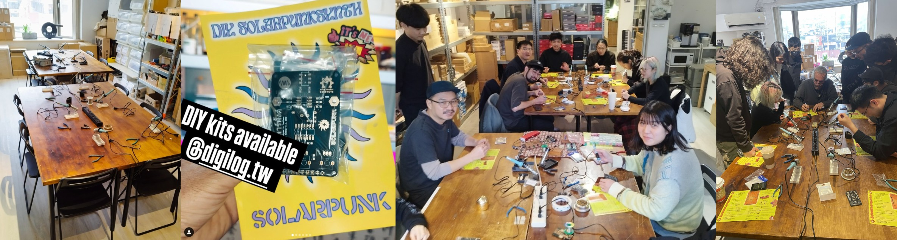

# SolarpunkSynth 🌞🎹

A solar-powered synthesizer that creates experimental sounds, rhythmic patterns, and beats using minimal energy from the sun! This project embodies the spirit of solarpunk by combining sustainable energy with creative expression.

## Description

The SolarpunkSynth is an ultra-low power consumption synthesizer that can be powered by:
- Silicon solar cells
- DIY DSSC (Dye-sensitized solar cells)
- Alternative power sources (mud batteries, potato power, coconut energy)
- Nearly depleted batteries (due to extremely low power requirements)

## Project Variants

This repository contains two versions of the SolarpunkSynth:

### 1. Original SolarpunkSynth
Located in [`/SolarPunkSynth`](./SolarPunkSynth)
- The original version of the solar-powered synthesizer
- Simple and elegant design
- Perfect for beginners and workshops
- Includes complete documentation and assembly instructions

### 2. Digilog Edition
Located in [`/SolarSynth_digilog`](./SolarSynth_digilog)
- Enhanced version with digital-inspired aesthetics
- Developed for the Digilog exhibition in Taipei, Taiwan
- Features artistic PCB design with custom graphics
- Same core functionality with a unique visual style

## Technical Details

The synthesizer is built around these key features:
- Based on hex-inverter chip (74HC14)
- Three interdependent oscillators coupled through piezo discs
- Ultra-low energy consumption (<0.5mA)
- Audio output via 3.5mm jack
- Organic, variable rhythms through unstable circuit states
- KiCad PCB design files included

### Technical Differences Between Variants

#### Original SolarpunkSynth
- Simple and robust circuit design
- Direct audio output from oscillator circuit
- Basic component selection for easy assembly
- Standard PCB layout optimized for functionality
- Ideal for workshops and educational purposes

#### Digilog Edition Enhancements
- Added MCP6002 dual op-amp for improved audio output buffering
- Enhanced signal conditioning with additional filtering capacitors
- Modified component values for better stability
- Custom footprint library optimized for artistic PCB layout
- Artistic PCB design with custom traces and visual elements
- ENIG finish recommended for superior aesthetic presentation
- Optional acrylic cover design for finished look and protection

### Schematic

You can also view the [minimal schematic as PDF](./SolarPunkSynth/instructions/DSSC_Synthminimal_schema.pdf).

## Assembly Instructions

### Original SolarpunkSynth

For the original SolarpunkSynth version:
- [Detailed Soldering Guide (PDF)](./SolarPunkSynth/instructions/SolderInstruction.pdf)
- [Soldering Guide (SVG)](./SolarPunkSynth/instructions/SolderInstruction.svg)
- **[Complete step-by-step assembly instructions](./SolarPunkSynth/README.md#detailed-step-by-step-assembly-instructions)** are included in the SolarPunkSynth README.md

### Digilog Edition

Instruction photos are available:

For the Digilog edition, additional documentation is available:
- [Leaflet Format Instructions (PDF)](./SolarSynth_digilog/instructions/SolarpunkSynth_SolderInstruction_leaflet.pdf)
- [Inside Pages (PDF)](./SolarSynth_digilog/instructions/SolarpunkSynth_SolderInstruction_leaflet_inside.pdf)
- [Outside Pages (PDF)](./SolarSynth_digilog/instructions/SolarpunkSynth_SolderInstruction_leaflet_outside.pdf)

## Repository Contents

- [`/SolarPunkSynth`](./SolarPunkSynth) - Original version KiCad files and documentation
  - [`/002_SolarPunkSynth_footprints.pretty`](./SolarPunkSynth/002_SolarPunkSynth_footprints.pretty) - Custom footprints for the PCB
  - [`/MASK`](./SolarPunkSynth/MASK) - PCB mask files and design assets
  - [`/instructions`](./SolarPunkSynth/instructions) - Assembly guides and schematics
  - [`/svg2shenzhen`](./SolarPunkSynth/svg2shenzhen) - SVG files for PCB artwork

- [`/SolarSynth_digilog`](./SolarSynth_digilog) - Digilog edition KiCad files
  - [`/3d_models`](./SolarSynth_digilog/3d_models) - 3D models of components
  - [`/DIY_pcb`](./SolarSynth_digilog/DIY_pcb) - DIY PCB patterns and masks for custom fabrication
  - [`/acrylicCover_digilog`](./SolarSynth_digilog/acrylicCover_digilog) - Design files for the optional acrylic protective cover
  - [`/gerber`](./SolarSynth_digilog/gerber) - Manufacturing files
  - [`/instructions`](./SolarSynth_digilog/instructions) - Enhanced assembly guides in multiple formats
  - [`/svg2shenzhen`](./SolarSynth_digilog/svg2shenzhen) - Custom PCB artwork files
  - [`BOM.ods`](./SolarSynth_digilog/BOM.ods) - Detailed bill of materials in OpenDocument Spreadsheet format

- [`/photos`](./photos) - Project photos and workshop documentation

## DIY PCB Fabrication

For those interested in creating their own PCBs at home or in makerspaces, the Digilog edition includes DIY PCB files:
- [`SolarSynth_MASK.png`](./SolarSynth_digilog/DIY_pcb/SolarSynth_MASK.png) - Printable mask pattern for toner transfer or photolithography
- [`SolarSynth_digilog_MASK.svg`](./SolarSynth_digilog/DIY_pcb/SolarSynth_digilog_MASK.svg) - Vector version of the mask for scaling and modifications

These files can be used with common DIY PCB fabrication methods like toner transfer, photolithography, or CNC milling.

## Acrylic Cover

The Digilog edition offers an optional aesthetic acrylic cover:
- [`acrylCover_digilog.dxf`](./SolarSynth_digilog/acrylicCover_digilog/acrylCover_digilog.dxf) - CAD file for laser cutting
- [`drawing.svg`](./SolarSynth_digilog/acrylicCover_digilog/drawing.svg) - Vector drawing for preview and modifications

The acrylic cover enhances the visual appeal while providing protection to the electronics.

## Workshop Information

A solar-powered synthesizer that creates experimental sounds, rhythmic patterns, and beats using minimal energy from the sun! This project embodies the spirit of solarpunk by combining sustainable energy with creative expression.

<figure>
  
  <figcaption><em>Impressions from the workshop at digilog, Taipei, February 2025</em></figcaption>
</figure>

This project is designed to be beginner-friendly and has been successfully taught in workshops across various locations including:
- Taipei, Taiwan (Digilog)
- Chiang Mai, Thailand
- Tokyo, Japan (FabCafe)

No prior electronics knowledge is required - just enthusiasm for experimental sounds and solar-powered creativity!

<figure>
  
  <figcaption><em>Photos from the SolarpunkSynth Workshop at Parang Cafe & Art Stay, Chiang Mai, Thailand</em></figcaption>
</figure>

## Credits

This circuit is a modified version of the StarvationSynth originally developed by Ralf Schreiber and Uwe Schüler. The current version was specifically developed by Marc Dusseiller (dusjagr) to support the exhibition "1,540,000nm DSSC" by Shih Wei-Chieh at FabCafe Tokyo.

### Tools Used
- [svg2shenzhen](https://github.com/badgeek/svg2shenzhen) - An Inkscape extension that converts SVG drawings to KiCad PCB layouts, allowing for artistic and unrestricted PCB designs with support for any kind of shapes, drill pads, and edge cuts. Special thanks to Budi Prakosa ([@badgeek](https://github.com/badgeek)) for creating this amazing tool!
- KiCad - PCB design software

## Links

- [Project Wiki](https://www.hackteria.org/wiki/SolarpunkSynth)
- [Hackteria Network](http://hackteria.org/)
- [SGMK](https://mechatronicart.ch/)
- [Bitwäscherei Hackerspace](https://bitwaescherei.ch/)

## License

This project is open hardware - feel free to modify and share!

This project is licensed under the CERN Open Hardware License Version 2 - Permissive (CERN-OHL-P v2). This means you are free to:
- Study
- Modify
- Make
- Distribute

without any obligation to share your changes or modifications.

For more details, see the [LICENSE](./LICENSE) file.
