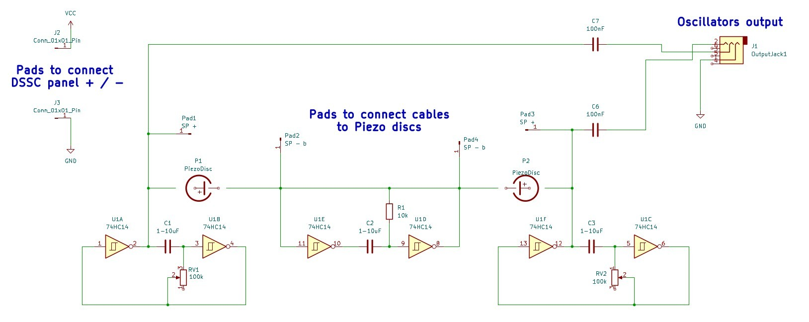
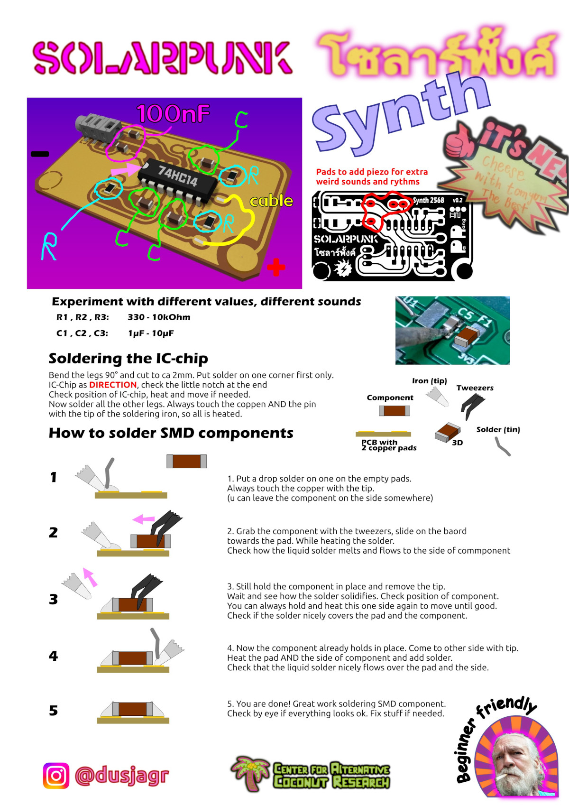

# SolarpunkSynth 🌞🎹

A solar-powered synthesizer that creates experimental sounds, rhythmic patterns, and beats using minimal energy from the sun! This project embodies the spirit of solarpunk by combining sustainable energy with creative expression.

## Description

The SolarpunkSynth is an ultra-low power consumption synthesizer that can be powered by:
- Silicon solar cells
- DIY DSSC (Dye-sensitized solar cells)
- Alternative power sources (mud batteries, potato power, coconut energy)
- Nearly depleted batteries (due to extremely low power requirements)

## Technical Details

The synthesizer is built around these key features:
- Based on hex-inverter chip (74HC14)
- Three interdependent oscillators coupled through piezo discs
- Ultra-low energy consumption (<0.5mA)
- Audio output via 3.5mm jack
- Organic, variable rhythms through unstable circuit states
- KiCad PCB design files included

### Schematic

## Assembly Instructions

Detailed soldering instructions are provided to help you build your own SolarpunkSynth:

For complete assembly instructions:
- [Detailed Soldering Guide (PDF)](SolarPunkSynth/instructions/SolderInstruction.pdf)
- [Soldering Guide (SVG)](SolarPunkSynth/instructions/SolderInstruction.svg)

## Repository Contents

- `/SolarPunkSynth/` - KiCad project files including schematics and PCB design
- `/SolarPunkSynth/002_SolarPunkSynth_footprints.pretty/` - Custom footprints for the PCB
- `/MASK/` - PCB mask files and design assets
- `/SolarPunkSynth/instructions/` - Assembly guides and schematics

## Workshop Information

This project is designed to be beginner-friendly and has been successfully taught in workshops across various locations including:
- Taipei, Taiwan (Digilog)
- Chiang Mai, Thailand
- Tokyo, Japan (FabCafe)

No prior electronics knowledge is required - just enthusiasm for experimental sounds and solar-powered creativity!

## Credits

This circuit is a modified version of the StarvationSynth originally developed by Ralf Schreiber and Uwe Schüler. The current version was specifically developed by Marc Dusseiller (dusjagr) to support the exhibition "1,540,000nm DSSC" by Shih Wei-Chieh at FabCafe Tokyo.

## Links

- [Project Wiki](https://www.hackteria.org/wiki/SolarpunkSynth)
- [Hackteria Network](http://hackteria.org/)
- [SGMK](https://mechatronicart.ch/)
- [Bitwäscherei Hackerspace](https://bitwaescherei.ch/)

## License

This project is open hardware - feel free to modify and share!
